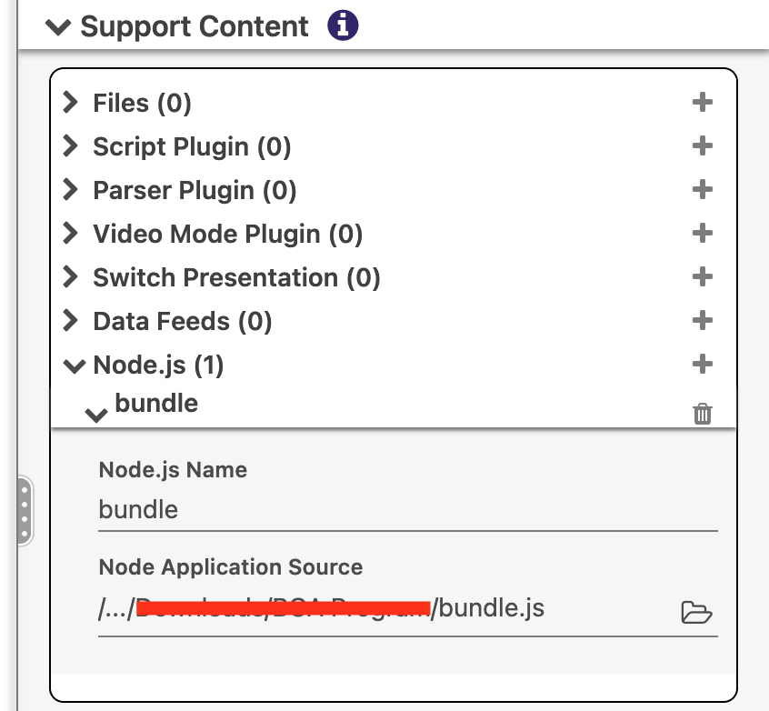
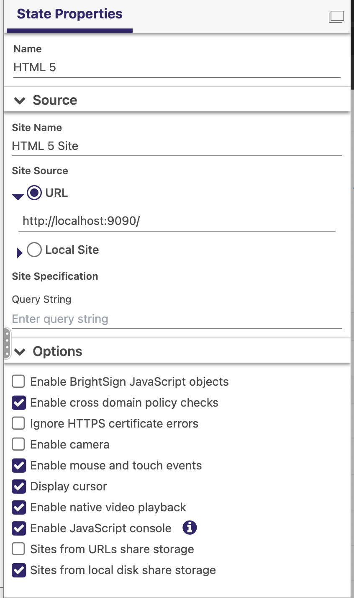

# BrightSign Node.js Sample

This project provides a small modification to the NodeJS Starter Project located here: https://github.com/brightsign/node.js-starter-project

This sample BrightAuthor:connected application shows how to instantiate a node.js server that runs on a BrightSign player. It creates a web server that can serve static files from port 9090.

It is helpful when you are trying to use the `fetch` or `XMLHttpRequest` APIs to retrieve a file from the file system. Due to security policies on modern browsers, you'll likely encounter an error stating the `file` protocol is not supported. One way to bypass this is by disabling web security on the web browser. However, if you continue to experience issues after disabling web security, this project will allow you to:

1. Run a light web server on the BrightSign player
2. Serve your HTML project files from this light web server

This example was created for BrightAuthor:connected.

## Prerequisites

- If you don’t have it already, download Nodejs to install Node.js and npm.
    - As of the creation of this project, the NodeJS version supported by BrightSign players is 14.17.6
- Your computer and BrightSign player must be connected to the internet.
- BrightAuthor:connected should already be downloaded and installed on your computer.

## Deploying a Node.js Server Application with BrightAuthor:connected

### Create your Node.js Application

1. Clone or download the project.
2. If you have not run npm previously, run **npm init** in your terminal to initialize the install. If you wish, you can import other modules with **npm  install** for additional functionality.
3. Import the node modules you will need your application to function and write your JavaScript code (in this example, the node modules are all included in express and the JavaScript is in index.js). From the _Downloads_ folder, run:

```
npm install --save express 
```

4. Run these Webpack commands to package your node application as a single JavaScript file (see Appendix B: Notes for more details):

```
npm install --save-dev webpack webpack-cli copy-webpack-plugin zip-webpack-plugin
npx webpack --mode production
```

### Create your Application

After running Webpack, follow the steps below to create your application. This example assumes that you have the latest version of BrightAuthor:connected:

1. After you execute the `npx webpack --mode production` command above, a `dist` folder will be created. Copy the `bundle.js` file in this folder and save it to the same directory as the `index.html` for your HTML web app.
2. In your **Presentation**, expand **Presentation Settings > Supported Content > Node.js** and add a new entry.
3. Under **Node Application Source**, find the `bundle.js` file you saved in step 1 above, and click OK.
   
4. Add an HTML 5 widget to your presentation and, under **State Properties**, set the **Site Source** to URL = `http://localhost:9090/`
   
5. Save and publish your presentation.

## Appendix

### Appendix A: An Alternate Method

If you have a more complex node application, or don't have the latest version of BrightAuthor:connected, you can use these steps to create your application:

1. Create an html file or use the **node-server.html** file that is provided in the _node.js-starter-project-master_ folder, as the application entry point.
2. In the **Presentation** dropdown menu, select **New Presentation** and enter a presentation name.
3. Expand **Presentation Settings** and select **Support Content**.
4. Under **Script Plugin**, add your plugin or use **node-server.brs** from the example, to enable Node.js in your presentation.
5. Use the “File Select” icon to add your application zip as an additional file (for example, **dist/node-server.zip**).

### Appendix B: Notes

- The  node_modules directory contains a lot of unnecessary files in addition to the code your application needs, and its size can be a problem when you deploy your application to an SD card or publish it to the cloud. [Webpack](https://webpack.js.org), which bundles JavaScript modules to use in browsers, solves this problem.
- An example is included to help you use [BrightSign Javascript objects](http://docs.brightsign.biz/display/DOC/JavaScript+API). See the "externals" section of the webpack.config.js.
- See the BrightSign [Node.js documentation](http://docs.brightsign.biz/display/DOC/Node.js) for more information.
